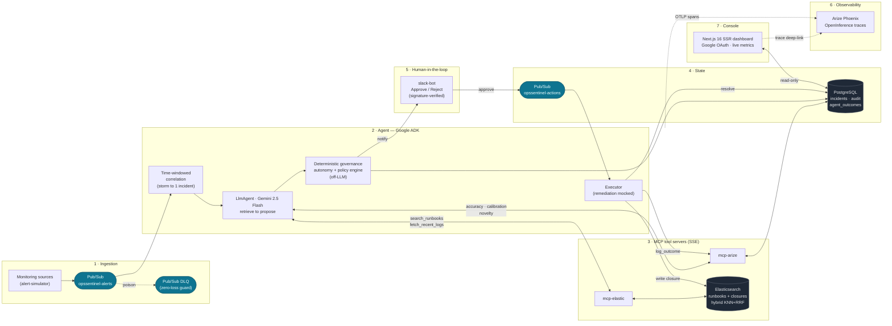

# OpsSentinel — Architecture

Drop the diagram below into your slide deck: paste the Mermaid block into
[mermaid.live](https://mermaid.live) and export **PNG/SVG**, or render it inline on GitHub.
A plain-English legend follows for narration.

## System diagram

## How to narrate it (the data's journey)

1. **Ingestion** — monitoring signals land on the `opssentinel-alerts` Pub/Sub topic. A dead-letter
   queue catches anything unprocessable, so the pipeline can prove **zero alert loss**.
2. **Correlate** — the agent's time-windowed correlator folds a storm of 50+ related signals into a
   **single incident** (Exit Criterion 1).
3. **Reason (RAG, real tool-use)** — a Google **ADK `LlmAgent`** on Gemini 2.5 Flash calls two
   **MCP tool servers** over SSE: `mcp-elastic` does hybrid (KNN + RRF) runbook retrieval and log
   lookup from Elasticsearch; `mcp-arize` returns the agent's own historical category accuracy,
   calibration, and novelty. The proposal's root cause and fix are **grounded in the retrieved
   runbook**, not hallucinated.
4. **Govern (safe autonomy)** — deterministic, off-LLM logic sets the **autonomy tier** and policy
   (severity floor, approval requirement). The decision is auditable and not at the model's mercy.
5. **Human-in-the-loop** — the brief posts to Slack with **Approve / Reject** buttons
   (signature-verified). Approval flows back through the `opssentinel-actions` topic.
6. **Execute + remember** — the executor runs the (mocked) remediation, resolves the incident, writes
   a **closure summary back into Elasticsearch**, and logs the **outcome to Arize** — closing the
   memory loop so the next incident retrieves this resolution (Exit Criterion 2).
7. **Observe + render** — every step is an **OpenInference trace in Phoenix**; the **Next.js SSR
   dashboard** (Google-authenticated) renders live incidents and reliability metrics and deep-links
   each incident to its Phoenix trace (Exit Criterion 3).

> Everything ships to **Google Cloud** via Terraform (Cloud Run, Cloud SQL, Pub/Sub, Secret Manager,
> a global load balancer + Cloud CDN) — see `docs/DEPLOYMENT-GCP.md`.
